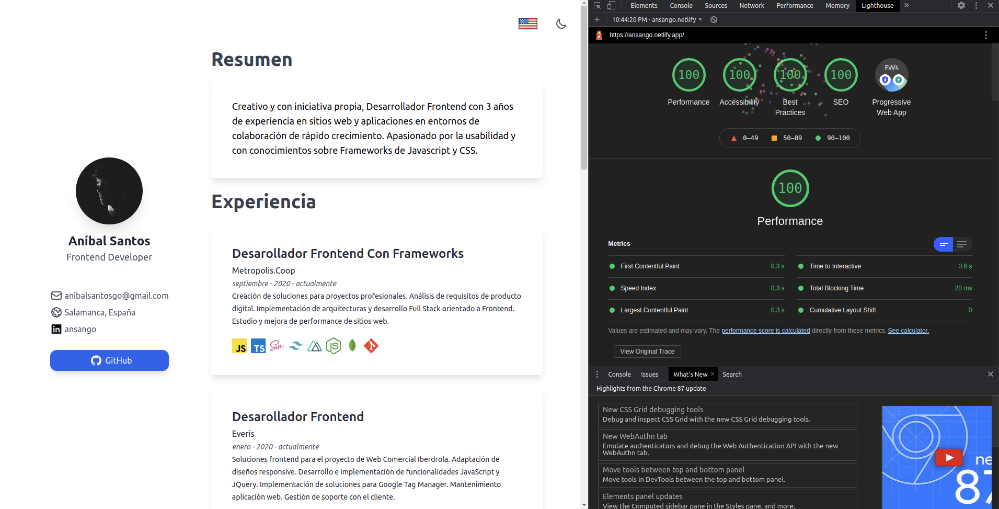

<h1 align="center">My resume 👋</h1>

### Hi there!

This is my personal resume, it is developed in NuxtJS and TailwindCSS and deployed in Netlify.

It has obtained a 100% performance in Google's Lighthose.


<br/>

Feel free to fork and reuse the project.

## Build Setup

```bash
# install dependencies
$ npm install

# serve with hot reload at localhost:3000
$ npm run dev

# build for production and launch server
$ npm run build
$ npm run start

# generate static project
$ npm run generate
```

For detailed explanation on how things work, check out [Nuxt.js docs](https://nuxtjs.org).

Enjoy!
